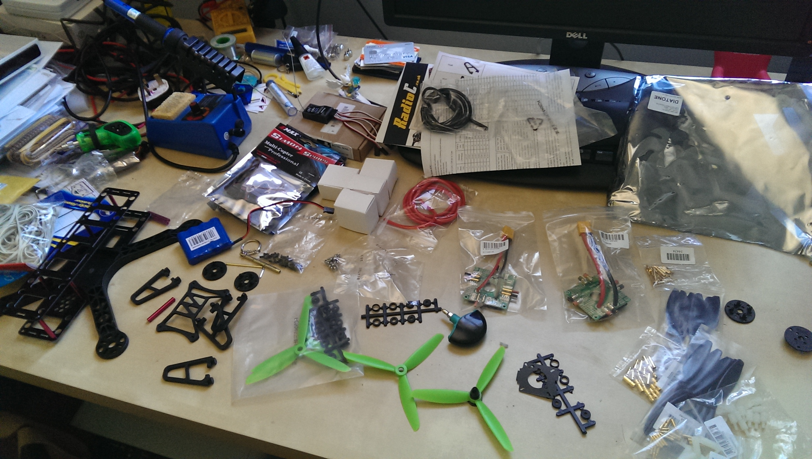
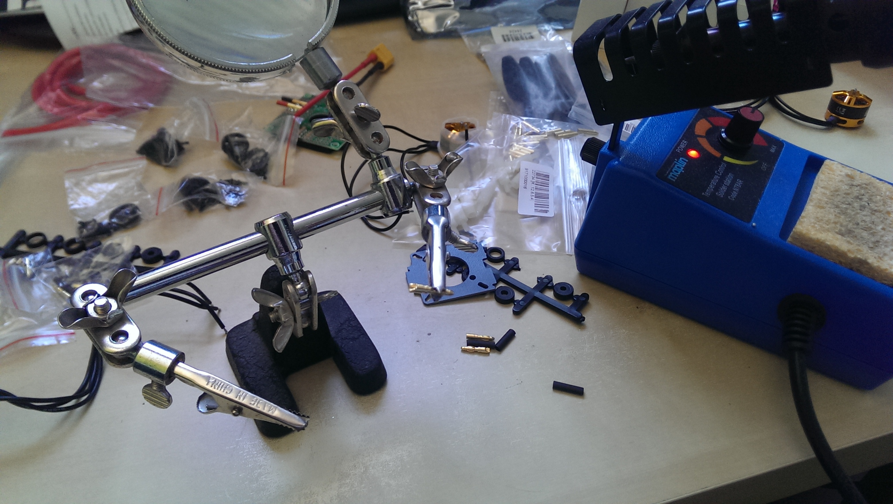
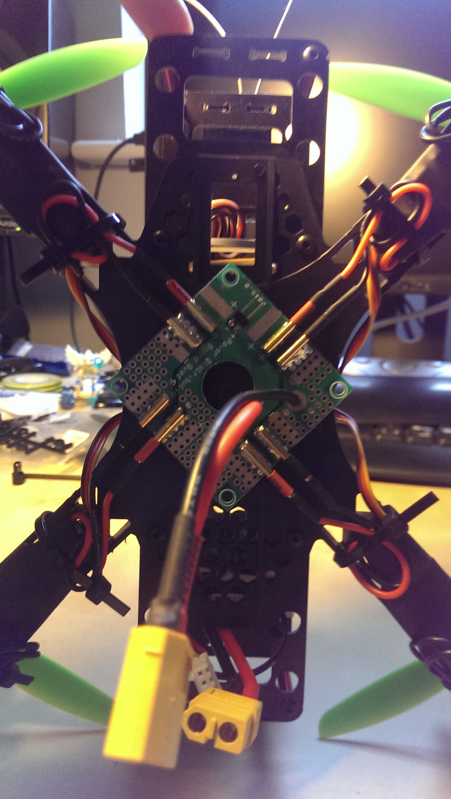

So this bunch of parts will soon turn into DogeCopter

First to solder 32 of these 2mm bullet connecters, 12 on the motors, 20 on the ESCs. 

THEY'RE TINY AAARGH!

Motors done, heatshrink added:

Damn these are some fine motors:

ESC bullets soldered, still needing heatshrink at this point:

Frame mostly built and with the power distribution board (pre-built) stuck on with double sided sticky:

Motors starting to be attached to the frame:

Attaching the ESCs to the frame arms:

It's going to look great:

Initial electronics check:

This is the main flight controller (APM 2.6). If you look closely you'll see JP1 in the top left corner which needs bridging with solder.  On the left hand side, 4 pins need soldering in for connection to the RaspberryPi

Done! Easy!!

Now the case lid needs modifying to allow the pins through, out comes the dremel!

So good, it looks like it was meant to be (lolz)

At this point, it seemed wise to have a maiden flight.  All was wired up, calibrated.

Placed on the floor.

A step back.

Armed.

Throttle up.

BAM!

It flipped almost straight over onto it's back breaking one of the propellers in the process:

After much crying and such tears, it was decided that one of two things caused it:

1) Centre of gravity was off (battery at back of quad) although this should be fine!
2) Motor/prop combo span wrongly

After checking, one of the motors appeared to be spinning wrong.

Bit of superglue later, tidying wires and a little bit of TLC and it's finished:

