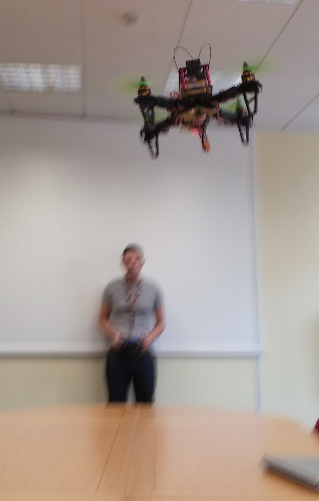

Since the disaster [earlier this week](http://bmtwebdevs.github.io/DogeCopter/Maiden-Flight-Video/) the team have doubled-down in their efforts to get a fully automated battle hardened robitic hover quadcopter to fly without immediately firing sharpened rotors flying out 12000RPM directly at our faces. I haven't checked the small print in the competition points scheme, but I'm pretty sure that maiming or death of a member of the audience will result in some sort of deduction, at best.

First thing was to buy a few more rotors. They now have ALL of the rotors, in the whole world. Sorry, other teams.

Then breakfast:

Then they tried a private test flight out in the boardroom. The little battery lasted around 2.5 minutes, the bigger one ran out of juice around 8-9 minutes in, seemingly without any warning! Amazingly, everyone, including dogecopter emerged unscathed, and the flight was pronounced a success! 

<iframe width="640" height="480" src="//www.youtube.com/embed/oT2VzKDB1co" frameborder="0" allowfullscreen></iframe>
**The only video taken seems to be of when it was bouncing around on the floor and scaring Gareth (the scaredy cat) but it really did fly, honest!**

**Presentation to the board, steady flight!**

**They somehow persuaded Simon to test the altitude hold. Brave, foolish Simon.**

**Action shot!**

This progress has greatly pleased the Judges, who are insisting on regular reviews from all of the teams in the competition, presumably to ensure that company cash isn’t being frittered away on, say...I don’t know…Beer and barbequed meat products, for instance.

**Team workshop, at Grillstock; our local bar. Incidently, they do excellent BBQ.**

Afterwards, the team reconvened in the team workshop to discuss further frame designs. I’ve seen planks of wood, and also some plate aluminium, so I reckon that lovely prebuilt fibreglass frame is likely to be replaced by something akin to the bride of Frankenstein, but we’ll see. I’ve got every faith.

Impressively, the team didn’t stop there, continuing to plug in more electronic widgets throughout the week. Next to go on – the Raspberry Pi. This interfaces with the Arduino flight controller, via a wire designed by Gareth and then bodged together by Richard so the team get a few more options in terms of control. 

**Currently they’ve attached a WiFi dongle and can now (just about) fly the thing using an Xbox controller attached to a PC. Aint she a beauty?**

<iframe width="640" height="480" src="//www.youtube.com/embed/rUOmfPTZNbM" frameborder="0" allowfullscreen></iframe>

**Richard reckons they can recalibrate the controller to be a bit less twitchy**

Here you can see the copter flying by WiFi. The laptop is displaying telemetry in real time.

Unfortunately it didn’t crash and provide this blog with a good weekend send off, so instead here is a picture of Luke making some important modifications with a spoon.

If you look closely you can still see tongue marks and yoghurt remnants on the spoon, which is nice. If you have access to the tongue mark database up at GCHQ you’ll probably be able make the match yourselves, but to save you the time, I’ll tell you that it is Jeremy’s tongue. Poor guy – one moment eating a massive tub of 0% Yeo Valley Vanilla Yoghurt (honestly, what is the point?), the next he knows his tongue is left hanging in vacant space whilst his spoon is being forcefully inserted into the business end of a freakishly modified flying doge.

Stay tuned next week with more news from Jeremy’s tongue as well as probably something about a flying hover copter mowing down Baths finest intellectual minds (and this blogger).

ANIMATED GIFS, because.

